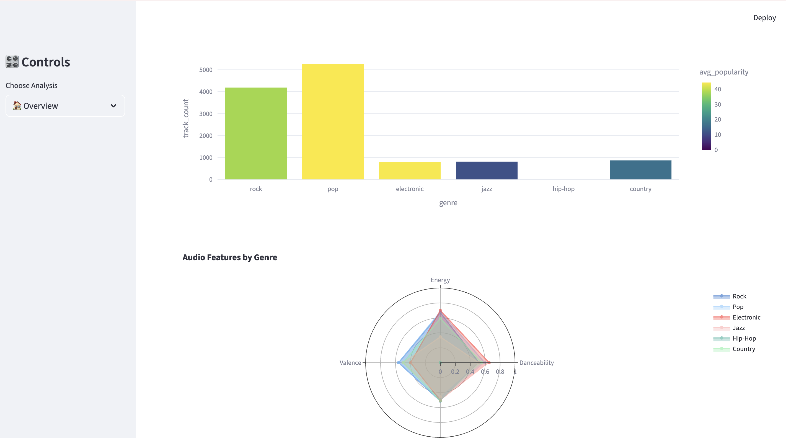
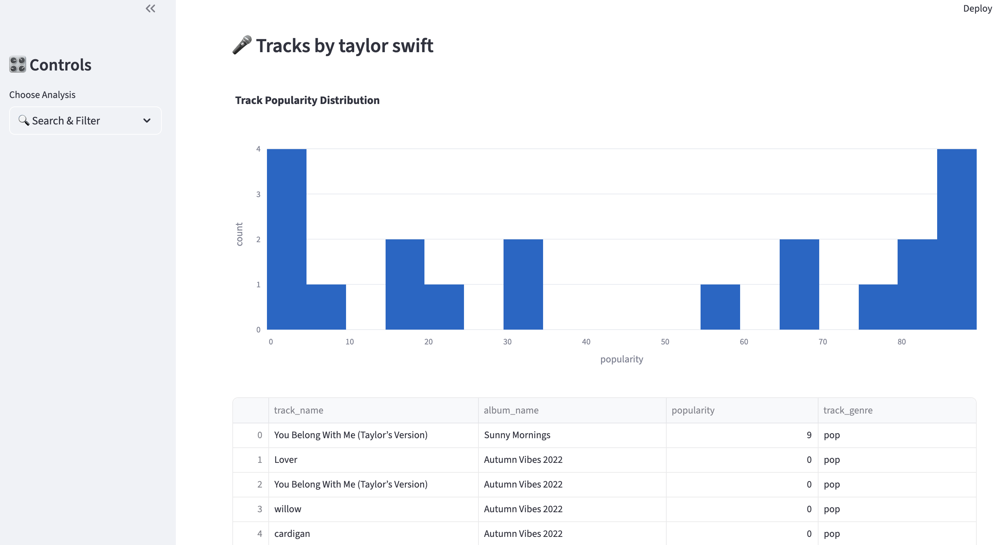

# 🎵 Spotify Music Explorer

A powerful music analytics platform using Elasticsearch, FastAPI, and Streamlit for exploring Spotify track data with advanced search and AI-powered recommendations.

[](https://python.org)
[](https://elastic.co)
[](https://fastapi.tiangolo.com)
[](https://streamlit.io)

## ✨ Features

- 🔍 **Smart Search** - Find tracks by title, artist, or album
- 📊 **Genre Analytics** - Compare audio features across genres
- 🎯 **AI Recommendations** - Vector-based similarity search
- 👥 **Artist Rankings** - Top performers by genre and popularity
- 📈 **Interactive Dashboards** - Real-time visualizations with Plotly

## 🚀 Quick Start

```bash

# Clone repository
git clone https://github.com/jgchoti/elastic-search-music-explorer.git
cd elastic-search-music-explorer

# Start all services with Docker Compose (Elasticsearch + Kibana + App)
docker-compose up --build -d

# Wait for services to initialize (about 2-3 minutes)
# Check if services are ready
docker-compose ps

# Verify Elasticsearch is running
curl http://localhost:9200/_cluster/health

# Verify Kibana is accessible
curl http://localhost:5601/api/status

# Index your data (run once after services are up)
docker-compose exec spotify-app python backend/elasticsearch_client.py

```

## 🎯 Demo

- Streamlit Dashboard: http://localhost:8501
- FastAPI Documentation: http://localhost:8000/docs
- Kibana Analytics: http://localhost:5601
- Elasticsearch: http://localhost:9200




## 🏗️ Architecture

```
Backend (FastAPI) ↔ Elasticsearch ↔ Frontend (Streamlit)
     ↓                    ↓              ↓
API Endpoints         Search Index    Visualizations
Vector Search         Audio Features  Interactive Charts
```

## 📊 Dataset

Uses [Spotify Tracks Dataset](https://www.kaggle.com/datasets/maharshipandya/-spotify-tracks-dataset) with:

- 114,000+ tracks
- Audio features (danceability, energy, valence, tempo)
- Metadata (artist, album, genre, popularity)

## 🔧 Key Technologies

- **Search**: Elasticsearch with vector similarity
- **Backend**: FastAPI with async support
- **Frontend**: Streamlit + Plotly visualizations

## 📱 Main Features

| Feature                | Description                                    |
| ---------------------- | ---------------------------------------------- |
| **Search & Filter**    | Advanced text search with genre/year filtering |
| **Genre Analytics**    | Compare audio features across music genres     |
| **Artist Rankings**    | Top artists by popularity and track count      |
| **Real-time Stats**    | Live dashboard with collection insights        |
| **AI Recommendations** | Vector-based similar track suggestions         |
